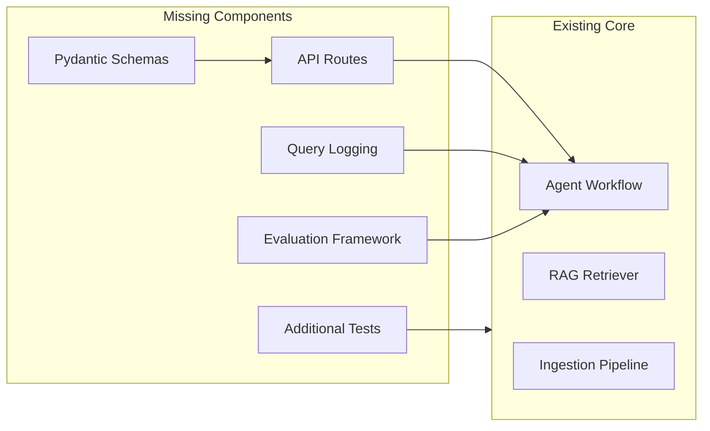

# Complete Missing MVP Components

## Current Status Summary

**Fully Implemented:**

- Database models (Users, HealthProfiles, Papers, PaperChunks, QueryLogs)
- Ingestion pipeline (PDF parsing, chunking, embeddings, vector storage)
- LangGraph agent workflow (all 5 nodes: Query Analyzer, Retriever, Risk Assessor, Reasoner, Response Generator)
- Hybrid search retriever (semantic + BM25 with RRF fusion)
- Guardrails, prompts, and disclaimers
- All cloud service clients (Azure OpenAI, Document Intelligence, GCP Storage, Langfuse)

**Missing Components:**



---

## 1. API Routes and Pydantic Schemas

The main entry point for mobile app integration is completely missing. Need to create:**File:** [`app/schemas/query.py`](app/schemas/query.py) - Request/Response models

```python
# Key schemas needed:
- QueryRequest (ph_value, health_profile, query_text)
- QueryResponse (summary, risk_level, insights, citations, disclaimers)
- HealthProfileSchema (age, ethnicity, symptoms, medical_history)
```

**File:** [`app/api/routes/query.py`](app/api/routes/query.py) - Main analysis endpoint

```javascript
POST /api/v1/query - Submit pH reading for analysis
- Receives pH value + health profile
- Invokes agent workflow via run_medical_agent()
- Logs query to QueryLog table
- Returns formatted response
```

**File:** [`app/api/routes/papers.py`](app/api/routes/papers.py) - Paper management

```javascript
POST /api/v1/papers/upload - Upload new paper
GET /api/v1/papers - List papers
GET /api/v1/papers/{id}/status - Check processing status
```

---

## 2. Query Logging Integration

The `QueryLog` model exists in [`app/db/models.py`](app/db/models.py) but is never used. Need to:

- Add logging after agent workflow completion in the query endpoint
- Store: pH value, health profile snapshot, risk level, retrieved chunk IDs, response, processing time
- Enable compliance audit trail

---

## 3. Evaluation Framework

**File:** [`data/golden_set/questions.json`](data/golden_set/questions.json) - Golden set data structure

```json
{
  "test_cases": [
    {
      "id": "case_001",
      "ph_value": 4.8,
      "health_profile": {...},
      "expected_risk_level": "MONITOR",
      "expected_topics": ["elevated pH", "monitoring"]
    }
  ]
}
```

**File:** [`evaluation/evaluator.py`](evaluation/evaluator.py) - Evaluation runner

- Load golden set
- Run agent for each test case
- Compute metrics: risk level accuracy, retrieval relevance, citation correctness
- Output report

---

## 4. Additional Tests

Add tests for:

- Agent nodes ([`tests/test_agent_nodes.py`](tests/test_agent_nodes.py))
- API endpoints ([`tests/test_api_query.py`](tests/test_api_query.py))
- End-to-end workflow ([`tests/test_e2e.py`](tests/test_e2e.py))

---

## Implementation Priority

| Priority | Component | Effort | Impact ||----------|-----------|--------|--------|| 1 | Pydantic Schemas | Low | Required for API || 2 | Query API Endpoint | Medium | Critical - main interface || 3 | Query Logging | Low | Compliance requirement || 4 | Paper Upload API | Medium | Admin functionality || 5 | Evaluation Framework | Medium | Quality validation || 6 | Additional Tests | Medium | Reliability |---

## Files to Create/Modify

**New Files:**

- `app/schemas/query.py` - Query request/response schemas
- `app/schemas/health_profile.py` - Health profile schemas
- `app/schemas/paper.py` - Paper management schemas
- `app/api/routes/query.py` - Main analysis endpoint
- `app/api/routes/papers.py` - Paper management endpoints
- `evaluation/evaluator.py` - Evaluation runner
- `evaluation/metrics.py` - Evaluation metrics