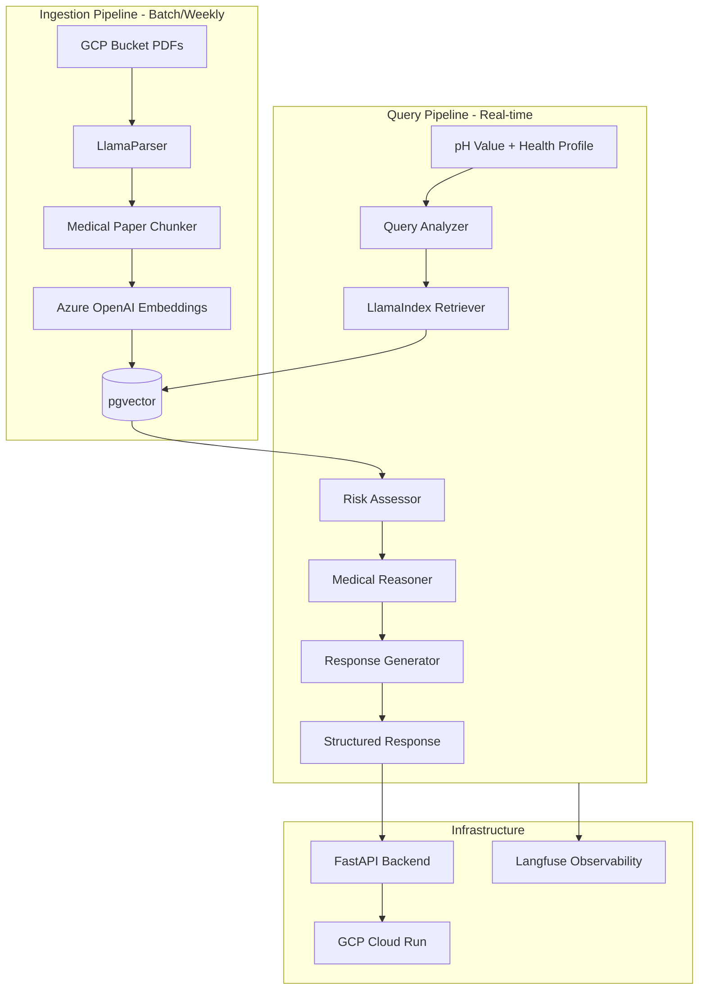
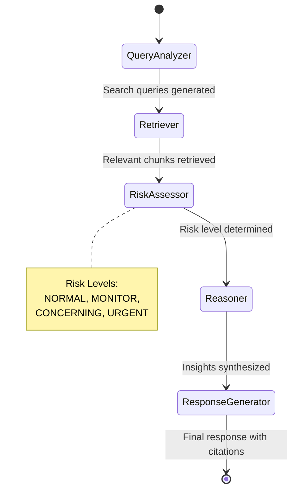

# FemTech Medical RAG Agent - Implementation Plan

## Project Overview

A mobile-first diagnostic platform for women's vaginal health. The CV model (built separately) provides pH values from test strip photos. This system takes that pH value plus user health profile and reasons over 250-500 curated medical research papers to provide personalized, evidence-based health insights.**Key Constraint**: Purely informational, NOT diagnostic. Strong guardrails required.---

## Technical Stack

| Component | Technology | Rationale ||-----------|------------|-----------|| Language | Python 3.11 | Stability with LangGraph/LlamaIndex || Package Manager | uv | Fast, modern, simple || Backend | FastAPI | Standard, async support || LLM | Azure OpenAI (GPT-4o) | GDPR compliance || Embeddings | Azure OpenAI (text-embedding-3-small) | Same ecosystem || Document Parsing | LlamaParser (LlamaCloud) | LlamaIndex integration, excellent table extraction || Vector DB | pgvector (PostgreSQL) | Simple, cost-effective || Agent Framework | LangGraph | Workflow orchestration || RAG Framework | LlamaIndex | Retrieval pipeline || Observability | Langfuse Cloud (Hobby) | Free tier, no self-hosting || Paper Storage | GCP Cloud Storage | Raw PDF storage || Database Hosting | GCP Cloud SQL | Managed PostgreSQL || Deployment | GCP Cloud Run | Pay-per-request, auto-scales to zero || Local Dev | Docker + docker-compose | Consistent environment || Auth | Placeholder (Zitadel later) | Deferred for MVP speed |---

## System Architecture



---

## LangGraph Agent Workflow



**Agent Nodes**:

1. **Query Analyzer** - Parse pH, extract symptoms, identify medical concepts, generate search queries
2. **Retriever** - Vector search via LlamaIndex, retrieve top-k chunks with metadata
3. **Risk Assessor** - Evaluate pH against normal range, cross-reference symptoms, determine urgency
4. **Reasoner** - Analyze evidence, correlate with profile, handle conflicting studies, synthesize insights
5. **Response Generator** - Format summary, add citations, include risk level, append disclaimers

---

## Database Schema

**Tables**:

- `users` - Basic user info, placeholder for auth
- `health_profiles` - Age, ethnicity, symptoms (JSONB), additional_info (JSONB)
- `papers` - Metadata (title, authors, journal, year, DOI), GCP path, parsed content
- `paper_chunks` - Content, chunk_type (abstract/results/table/etc), embedding vector(1536), metadata
- `query_logs` - User queries, pH value, profile snapshot, retrieved chunks, risk level, response, feedback

**Key Indexes**:

- IVFFlat index on embeddings for vector similarity search
- User-based index on query_logs for history retrieval

---

## Folder Structure

```javascript
Medical_Agent/
├── app/
│   ├── api/routes/          # FastAPI endpoints (health, query, papers, users)
│   ├── core/                # Config, security placeholder, exceptions
│   ├── db/                  # Database setup, models, repositories
│   ├── schemas/             # Pydantic models
│   ├── services/            # Business logic orchestration
│   └── main.py
├── agent/
│   ├── graph.py             # LangGraph workflow definition
│   ├── state.py             # Agent state schema
│   ├── nodes/               # Individual agent nodes
│   └── prompts/             # System prompts, templates, disclaimers
├── ingestion/
│   ├── pipeline.py          # Main orchestrator
│   ├── parsers/             # LlamaParser, fallback
│   ├── chunkers/            # Section-based medical paper chunking
│   ├── embedders/           # Azure OpenAI embeddings
│   └── storage/             # GCP bucket, vector store operations
├── rag/
│   ├── index.py             # LlamaIndex setup
│   ├── retriever.py         # Custom retriever with reranking
│   └── query_engine.py
├── evaluation/
│   ├── golden_set.py        # 50 Q&A test cases
│   ├── metrics.py           # Accuracy, relevance scoring
│   └── run_eval.py
├── scripts/                 # CLI scripts (ingest, seed, evaluate)
├── tests/
├── data/golden_set/         # Test cases JSON
├── alembic/                 # Database migrations
├── docker-compose.yml
├── Dockerfile
├── pyproject.toml
└── README.md
```

---

## Guardrails (Critical)

The AI must NEVER:

- Prescribe medication
- Diagnose specific conditions
- Give advice outside vaginal health scope
- Make claims not grounded in provided research papers

Every response must include medical disclaimers.---

## Risk Assessment Logic

| pH Range | Symptoms Present | Risk Level ||----------|------------------|------------|| 3.8-4.5 | None | NORMAL || 3.8-4.5 | Mild symptoms | MONITOR || 4.5-5.0 | Any | CONCERNING || Above 5.0 | Any | URGENT |Response templates vary by risk level (escalated urgency language for concerning/urgent).---

## Paper Processing Strategy

**Chunking**: Hierarchical section-based

- Level 1: Paper metadata + Abstract (standalone)
- Level 2: Section chunks (Intro, Methods, Results, Discussion, Conclusions)
- Level 3: Tables extracted separately with structured data

**Deduplication**: System detects duplicate papers, notifies user, user decides keep/reject based on update value.---

## Implementation Phases

### Phase 1: Foundation (Week 1)

- Project initialization with uv
- Docker + docker-compose setup (PostgreSQL + pgvector)
- FastAPI skeleton with health endpoints
- Database schema with Alembic migrations
- GCP project, bucket, and Cloud SQL setup
- Azure OpenAI and LlamaParser configuration
- Langfuse integration

### Phase 2: Ingestion Pipeline (Week 2)

- GCP bucket operations for PDF upload/retrieval
- LlamaParser parsing with table extraction
- Section-based chunking for medical papers
- Azure OpenAI embedding generation
- pgvector storage with similarity search
- Ingestion CLI script
- Test with 10-20 sample papers

### Phase 3: Agent Workflow (Week 3)

- LangGraph state schema definition
- Query Analyzer node
- LlamaIndex retriever integration
- Risk Assessor node with pH/symptom logic
- Reasoner node with medical reasoning prompts
- Response Generator with citations and disclaimers
- Guardrails implementation
- Langfuse tracing for all nodes

### Phase 4: Integration and Evaluation (Week 4)

- Complete API endpoints (query, papers, users)
- User health profile management
- Query logging for compliance and history
- Evaluation framework with golden set (50 Q&A)
- End-to-end testing
- Bug fixes and prompt tuning
- Documentation

### Buffer (10 days)

- Performance optimization
- Edge case handling
- Doctor review feedback incorporation
- Cloud Run deployment